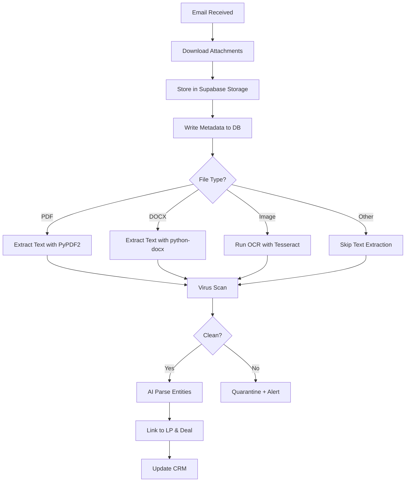

# LP CRM & Deal Signal Management Platform — PRD v2

**Product:** FundOps - LP Relationship & Deal Flow Intelligence Platform  
**Version:** 2.0  
**Date:** January 2026  
**Owner:** Fund Operations  
**Status:** Ready for Implementation

---

## Executive Summary

### Vision
Transform unstructured LP email communication into structured relationship intelligence, enabling VCs and fund managers to track, analyze, and optimize their fundraising operations.

### Business Case
**Current State:** Fund managers waste 10-15 hours/week manually tracking LP responses across fragmented email threads, spreadsheets, and memory.

**Target State:** Automated email ingestion, AI-powered parsing, and structured CRM reduce manual tracking by 70%, accelerate allocation decisions by 3-5 days, and provide unprecedented LP relationship analytics.

### Success Metrics (6 months post-launch)
- **Adoption:** 80% of LP communications tracked in system
- **Efficiency:** 70% reduction in time spent tracking responses
- **Accuracy:** <5% misclassification rate requiring manual correction
- **Speed:** Average allocation decision timeline reduced from 7 to 4 days
- **Engagement:** 3+ logins per week per active user

---

## 1. Problem Statement & Opportunity

### Current Workflow Pain Points

**Email Chaos:**
- 50-200 LP emails per deal spread across multiple threads
- No centralized view of who responded, who's interested, who passed
- Critical commitments buried in forwarded chains

**Manual Tracking:**
- Spreadsheet hell: copying names, amounts, dates by hand
- Version control nightmares when multiple partners update
- No audit trail of LP communication history

**Missed Opportunities:**
- Delayed responses to urgent LP questions
- Over-allocation or under-allocation due to poor visibility
- No data on LP response patterns or preferences

**Lack of Intelligence:**
- Can't answer "Which LPs respond fastest?"
- Can't analyze "What check sizes does this LP prefer?"
- No forecasting of allocation fill rates

### Market Opportunity
- **TAM:** 3,000+ VC firms in US running SPVs
- **Pain:** Universal problem for any fund doing deal-by-deal raises
- **Willingness to Pay:** High (saves senior time, improves LP relationships)
- **Competition:** Minimal (Carta, AngelList don't solve this)

---

## 2. Goals & Non-Goals

### Goals (V1)
✅ Centralize all LP email communication in one system  
✅ Automatically ingest emails and attachments from Gmail/Outlook  
✅ AI-parse LP identity, deal, intent, commitment amounts  
✅ Provide CRM views: by LP, by Deal, by Intent  
✅ Support configurable tagging taxonomy  
✅ Enable reprocessing as models/tags improve  
✅ Track attachment documents (commitment letters, KYC)  

### Goals (V2 - Future)
- Email sending (not just receiving)
- Calendar integration for LP calls
- Advanced analytics (LP scoring, cohort analysis)
- Integration with cap table tools

### Non-Goals (Out of Scope)
❌ Capital call execution (accounting system territory)  
❌ Legal document generation (DocSend, PandaDoc)  
❌ Fund accounting (Carta, Assure)  
❌ Full investor portal (separate product)  
❌ Bank integration or payment processing  

---

## 3. User Personas

### Primary: VC Partner / Fund Manager
**Profile:**
- Manages 2-8 SPVs per year
- 50-150 LP relationships
- Sends deal memos, tracks responses, allocates capacity

**Jobs to Be Done:**
- Know allocation status in real-time
- Respond to LP questions quickly
- Identify LPs for next deal
- Forecast close rates

**Pain Points:**
- Email overload during deal cycles
- Can't find that one LP's response from 2 weeks ago
- Doesn't remember who passed on last deal

### Secondary: VC Operations Manager
**Profile:**
- Supports 3-5 partners
- Manages LP onboarding, compliance, reporting
- "Spreadsheet therapist"

**Jobs to Be Done:**
- Maintain clean LP database
- Track KYC document status
- Generate allocation reports

**Pain Points:**
- Cleaning up partner's messy data
- Chasing missing documents
- Manual data entry from emails

### Tertiary: LP (Indirect User)
**Profile:**
- Receives deal memos via email
- Responds with interest/pass/questions
- May or may not be tech-savvy

**Expectation:**
- Email workflow doesn't change
- Responses are acknowledged
- Questions get answered

---

## 4. Core User Journeys

### Journey 1: New Deal Launch
**Trigger:** Partner sends deal memo to 75 LPs

**Flow:**
1. Partner creates deal in FundOps (`Deal: "Acme Series B"`)
2. Sends memo via normal email (CC: fundops@company.com or forward afterward)
3. System ingests memo, associates with deal
4. Over next 3 days, LP responses arrive
5. System auto-classifies: 25 interested, 15 passed, 10 questions, 25 no response
6. Partner reviews dashboard, sees $8M soft-committed vs $5M target
7. Partner manually adjusts 2 misclassifications
8. Partner exports allocation list for legal team

**Success:** Allocation decision made in 3 days instead of 7

### Journey 2: LP Sends Signed Commitment
**Trigger:** LP emails PDF commitment letter

**Flow:**
1. Email arrives: "Attached is our signed commitment for $500K"
2. System ingests email + PDF attachment
3. AI extracts: LP = "Smith Family Office", Deal = "Acme Series B", Amount = $500K, Intent = "committed"
4. PDF stored in `attachments/acme-series-b/smith-family-office/commitment_signed.pdf`
5. System updates deal status, flags "commitment received"
6. Partner gets notification
7. Partner reviews, marks as "allocation confirmed"

**Success:** Zero manual data entry, instant visibility

### Journey 3: LP Research Before New Deal
**Trigger:** Partner about to send new deal memo

**Flow:**
1. Partner opens LP profile for "Jones Capital"
2. Sees: Last 3 deals (2 participated, 1 passed), avg check $250K, avg response time 1.2 days
3. Notes show "prefers B2B SaaS, passes on consumer"
4. Partner includes Jones in memo distribution
5. Jones responds in 18 hours with "$300K soft commitment"

**Success:** Better targeting, faster response

### Journey 4: Manual Correction & Retraining
**Trigger:** AI misclassifies "maybe interested" as "declined"

**Flow:**
1. Partner reviews inbox, sees misclassification
2. Clicks "Edit", changes intent from "declined" to "interested"
3. Sets `manual_override = true`
4. System logs correction for future model improvement
5. Analytics dashboard shows 92% auto-classification accuracy

**Success:** Human-in-the-loop improves over time

---

## 5. Feature Requirements (Prioritized)

### Phase 1: MVP (6-8 weeks) — MUST HAVE

#### F1.1: Email OAuth Integration
- Gmail OAuth 2.0 (read scope)
- Outlook OAuth 2.0 (read scope)
- Token storage (encrypted)
- Token refresh automation
- Multi-account support (one user, multiple mailboxes)

#### F1.2: Email Ingestion Engine
- Cron job: poll every 5 minutes
- Fetch new messages since last poll
- Store in `emails_raw` table
- Idempotent message handling (dedupe by `message_id`)
- Thread tracking (`thread_id`)

#### F1.3: Basic AI Parsing
- **Fields to extract:**
  - LP name (person or firm)
  - Deal name
  - Intent (interested, committed, declined, question, neutral)
  - Commitment amount (if present)
- Confidence scores for each field
- Store in `emails_parsed` table

#### F1.4: Core Data Models
- `users` (fund managers)
- `lp_contacts` (LP database)
- `deals` (investment opportunities)
- `emails_raw` (raw email storage)
- `emails_parsed` (structured extraction)

#### F1.5: Basic CRM UI
- **Deals List:** Show all deals, # interested, # committed, total amount
- **Deal Detail:** List all LP responses for one deal
- **LP List:** Show all LPs
- **LP Profile:** Show all emails to/from one LP
- **Inbox View:** All emails, filter by deal/intent

#### F1.6: Manual Tagging
- Click email, select intent from dropdown
- Add notes
- `manual_override` flag

**Success Criteria:**
- Ingest 100% of emails within 5 min of receipt
- Parse LP + Deal with >80% accuracy
- Users can view all communications in one place

---

### Phase 2: Production Ready (4-6 weeks) — SHOULD HAVE

#### F2.1: Attachment Handling
- Download attachments to Supabase Storage
- Support: PDF, DOCX, XLSX, PNG, JPG
- Max size: 25MB per file
- Virus scanning (ClamAV or cloud service)
- Text extraction: PDF → text, DOCX → text
- OCR for scanned PDFs (Tesseract or Google Vision)
- Link attachments to emails and LPs
- Display attachments in LP profile

#### F2.2: Advanced Parsing
- Extract commitment amount with confidence
- Detect sentiment (positive, neutral, negative, urgent)
- Extract topics (legal, allocation, timeline, terms)
- Identify questions vs statements
- Parse dates (deadlines, meeting requests)

#### F2.3: Auto-Tagging System
- Define tag taxonomy in database
- AI assigns tags with confidence scores
- Manual tag addition/removal
- Tag-based filtering and search

#### F2.4: Manual Review Queue
- Low-confidence emails (<70%) flagged for review
- Batch review interface
- One-click corrections
- Corrections feed back to accuracy metrics

#### F2.5: Duplicate Detection
- Same LP, different email addresses
- Merge LP profiles
- Flag potential duplicates for review

#### F2.6: Notifications
- Daily digest: "5 new responses on Acme deal"
- Urgent flag: LP marked email as time-sensitive
- Commitment received alert

**Success Criteria:**
- Handle attachments for 100% of emails
- Parse amounts with >85% accuracy
- <10% of emails require manual review

---

### Phase 3: Intelligence Layer (6-8 weeks) — NICE TO HAVE

#### F3.1: Reprocessing Engine
- Bulk reprocess: all emails, by deal, by LP, by date range
- Version tracking (model v1, v2, etc.)
- Compare old vs new classifications
- One-click rollback if reprocessing makes things worse

#### F3.2: Taxonomy Manager
- UI to add/edit/deprecate tags
- Hierarchical tags (e.g., `legal > kyc > accreditation`)
- Tag synonyms (map "yes" → "interested")
- Usage analytics per tag

#### F3.3: Analytics Dashboard
- **Deal metrics:** Avg response time, interest rate, close rate
- **LP metrics:** Avg check size, response speed, participation rate
- **Trends:** Allocation fill rate over time
- **Forecasting:** Predicted final allocation based on soft commits

#### F3.4: Bulk Actions
- Select 20 emails, tag as "follow_up"
- Export filtered email list to CSV
- Archive old deals

#### F3.5: Advanced Search
- Full-text search across email body
- Filter by: deal, LP, date range, intent, tags, has_attachment
- Save search queries

#### F3.6: Email Webhooks (instead of polling)
- Gmail push notifications
- Outlook Graph API webhooks
- Real-time ingestion (<30 sec latency)

**Success Criteria:**
- Reprocess 10,000 emails in <10 minutes
- Provide actionable insights (e.g., "Your top 10 fastest-responding LPs")
- Users spend <2 hours/week on manual review

---

## 6. Tagging & Taxonomy System

### Tag Types

| Type          | Purpose                              | Examples                                             |
|---------------|--------------------------------------|------------------------------------------------------|
| `intent`      | LP's response signal                 | interested, committed, declined, question, neutral   |
| `deal_stage`  | Where deal is in lifecycle           | teaser, memo_sent, diligence, allocation_closed      |
| `topic`       | What email is about                  | legal, allocation, timeline, terms, portfolio_update |
| `priority`    | Action urgency                       | urgent, follow_up, fyi                               |
| `sentiment`   | Tone of message                      | positive, neutral, negative, excited                 |
| `document`    | Type of attachment                   | commitment_letter, kyc, w9, signed_agreement         |

### Tag Schema (Database)

**Table: `tags`**
```sql
id              UUID PRIMARY KEY
name            TEXT UNIQUE NOT NULL
type            TEXT NOT NULL  -- intent, topic, priority, etc.
parent_tag_id   UUID REFERENCES tags(id)  -- for hierarchies
description     TEXT
is_active       BOOLEAN DEFAULT true
created_at      TIMESTAMPTZ
```

**Table: `email_tags`**
```sql
id              UUID PRIMARY KEY
email_id        UUID REFERENCES emails_raw(id)
tag_id          UUID REFERENCES tags(id)
confidence      FLOAT  -- 0.0 to 1.0
source          TEXT   -- 'ai' or 'manual'
created_at      TIMESTAMPTZ
```

### Tag Management Features
- **Add tag:** UI to create new tag, specify type, optional parent
- **Deprecate tag:** Mark `is_active = false`, don't delete (for history)
- **Merge tags:** Combine duplicates (e.g., "interested" + "yes")
- **Usage stats:** Show # emails per tag, avg confidence
- **Retagging:** Trigger re-classification with new taxonomy

### Confidence Thresholds
- **>90%:** Auto-apply, green badge
- **70-90%:** Auto-apply, yellow badge
- **<70%:** Manual review required, red badge

---

## 7. Attachment Handling (Critical Feature)

### Supported File Types
- **Documents:** PDF, DOCX, TXT
- **Spreadsheets:** XLSX, CSV
- **Images:** PNG, JPG, GIF (for signatures, scanned docs)

### Attachment Storage Architecture

**Supabase Storage Bucket:** `email_attachments`

**Path Structure:**
```
email_attachments/
  {org_id}/
    {deal_id}/
      {email_id}/
        commitment_letter.pdf
        kyc_form.docx
```

**Metadata Table: `attachments`**
```sql
id                  UUID PRIMARY KEY
email_id            UUID REFERENCES emails_raw(id)
deal_id             UUID REFERENCES deals(id)
lp_contact_id       UUID REFERENCES lp_contacts(id)
file_path           TEXT NOT NULL
original_filename   TEXT NOT NULL
mime_type           TEXT NOT NULL
file_size_bytes     INTEGER
extracted_text      TEXT  -- from PDF/DOCX parser
ocr_text            TEXT  -- from image OCR
parsed_entities     JSONB  -- {amount, date, signatures, etc.}
virus_scan_status   TEXT  -- pending, clean, infected
virus_scan_at       TIMESTAMPTZ
processing_status   TEXT  -- pending, success, failed
error_message       TEXT
created_at          TIMESTAMPTZ
```

### Attachment Processing Pipeline



### Text Extraction Strategy
- **PDF:** `PyPDF2` or `pdfplumber`
- **DOCX:** `python-docx`
- **OCR:** `pytesseract` (for scanned PDFs or images)
- **Fallback:** If extraction fails, store as binary, flag for manual review

### Entity Extraction from Attachments
AI prompt analyzes extracted text for:
- **Signatures:** Detect "Signed by [Name]"
- **Amounts:** "$500,000" → commitment amount
- **Dates:** "Effective Date: Jan 15, 2026"
- **Legal entities:** "Smith Family Office LLC"
- **Document type:** Commitment letter, KYC form, W-9, etc.

### Use Cases
1. **Auto-detect signed commitments:** Flag `commitment_letter` tag, extract amount
2. **Track KYC completion:** Mark LP as "KYC submitted" when W-9 attached
3. **Legal compliance:** Store signed docs for audit trail
4. **Search attachments:** "Find all LPs who submitted KYC for Deal X"

### Error Handling
- **Too large:** Reject files >25MB, notify user
- **Virus detected:** Quarantine, alert admin, block download
- **Failed extraction:** Store file, flag for manual review, don't block ingestion
- **Corrupt file:** Log error, continue processing other attachments

---

## 8. Data Model (Supabase / Postgres)

### Core Tables

#### `users`
```sql
id                  UUID PRIMARY KEY DEFAULT uuid_generate_v4()
email               TEXT UNIQUE NOT NULL
name                TEXT
organization_id     UUID REFERENCES organizations(id)
role                TEXT  -- admin, partner, ops
created_at          TIMESTAMPTZ DEFAULT now()
```

#### `organizations`
```sql
id                  UUID PRIMARY KEY DEFAULT uuid_generate_v4()
name                TEXT NOT NULL
domain              TEXT  -- company.com
settings            JSONB  -- email parsing config, etc.
created_at          TIMESTAMPTZ DEFAULT now()
```

#### `lp_contacts`
```sql
id                      UUID PRIMARY KEY DEFAULT uuid_generate_v4()
organization_id         UUID REFERENCES organizations(id)
name                    TEXT NOT NULL
email                   TEXT NOT NULL
firm                    TEXT
title                   TEXT
phone                   TEXT
preferred_check_size    INTEGER  -- in USD
avg_response_time_hours FLOAT
total_commitments       DECIMAL(15,2)
participation_rate      FLOAT  -- % of deals they commit to
last_interaction_at     TIMESTAMPTZ
tags                    JSONB  -- ["high_priority", "b2b_focused"]
notes                   TEXT
created_at              TIMESTAMPTZ DEFAULT now()
updated_at              TIMESTAMPTZ DEFAULT now()

UNIQUE(organization_id, email)
```

#### `deals`
```sql
id                  UUID PRIMARY KEY DEFAULT uuid_generate_v4()
organization_id     UUID REFERENCES organizations(id)
name                TEXT NOT NULL  -- "Acme Series B"
company_name        TEXT  -- "Acme Corp"
description         TEXT
target_raise        DECIMAL(15,2)  -- $5M
min_check_size      DECIMAL(15,2)  -- $50K
max_check_size      DECIMAL(15,2)  -- $500K
deadline            TIMESTAMPTZ
status              TEXT  -- draft, active, closed, cancelled
total_committed     DECIMAL(15,2)  -- computed from emails_parsed
memo_url            TEXT  -- link to deal memo
created_at          TIMESTAMPTZ DEFAULT now()
updated_at          TIMESTAMPTZ DEFAULT now()
```

#### `emails_raw`
```sql
id                  UUID PRIMARY KEY DEFAULT uuid_generate_v4()
organization_id     UUID REFERENCES organizations(id)
message_id          TEXT UNIQUE NOT NULL  -- Gmail/Outlook message ID
thread_id           TEXT
from_email          TEXT NOT NULL
from_name           TEXT
to_emails           TEXT[]  -- array of recipients
cc_emails           TEXT[]
subject             TEXT
body_text           TEXT  -- plain text version
body_html           TEXT  -- HTML version
received_at         TIMESTAMPTZ NOT NULL
has_attachments     BOOLEAN DEFAULT false
raw_payload         JSONB  -- full email metadata
ingested_at         TIMESTAMPTZ DEFAULT now()
```

#### `emails_parsed`
```sql
id                      UUID PRIMARY KEY DEFAULT uuid_generate_v4()
email_id                UUID REFERENCES emails_raw(id) ON DELETE CASCADE
detected_lp_id          UUID REFERENCES lp_contacts(id)
detected_deal_id        UUID REFERENCES deals(id)
intent                  TEXT  -- interested, committed, declined, question, neutral
commitment_amount       DECIMAL(15,2)
sentiment               TEXT  -- positive, neutral, negative, urgent
topics                  TEXT[]  -- extracted topic keywords
entities                JSONB  -- all extracted entities
confidence_scores       JSONB  -- {lp: 0.95, deal: 0.88, intent: 0.92}
processing_status       TEXT  -- pending, success, failed, manual_review
manual_override         BOOLEAN DEFAULT false
reviewed_by             UUID REFERENCES users(id)
reviewed_at             TIMESTAMPTZ
model_version           TEXT  -- "claude-3.5-v1"
parsed_at               TIMESTAMPTZ DEFAULT now()
```

#### `attachments`
*(See section 7 above for full schema)*

#### `tags`
```sql
id                  UUID PRIMARY KEY DEFAULT uuid_generate_v4()
organization_id     UUID REFERENCES organizations(id)
name                TEXT NOT NULL
type                TEXT NOT NULL  -- intent, topic, priority, etc.
parent_tag_id       UUID REFERENCES tags(id)
description         TEXT
is_active           BOOLEAN DEFAULT true
created_at          TIMESTAMPTZ DEFAULT now()

UNIQUE(organization_id, name)
```

#### `email_tags`
```sql
id                  UUID PRIMARY KEY DEFAULT uuid_generate_v4()
email_id            UUID REFERENCES emails_raw(id) ON DELETE CASCADE
tag_id              UUID REFERENCES tags(id)
confidence          FLOAT  -- 0.0 to 1.0
source              TEXT  -- 'ai' or 'manual'
created_at          TIMESTAMPTZ DEFAULT now()

UNIQUE(email_id, tag_id)
```

#### `deal_lp_relationships`
```sql
id                      UUID PRIMARY KEY DEFAULT uuid_generate_v4()
deal_id                 UUID REFERENCES deals(id)
lp_contact_id           UUID REFERENCES lp_contacts(id)
status                  TEXT  -- contacted, interested, committed, allocated, declined
committed_amount        DECIMAL(15,2)
allocated_amount        DECIMAL(15,2)
first_contact_at        TIMESTAMPTZ
latest_response_at      TIMESTAMPTZ
response_time_hours     FLOAT
notes                   TEXT
created_at              TIMESTAMPTZ DEFAULT now()
updated_at              TIMESTAMPTZ DEFAULT now()

UNIQUE(deal_id, lp_contact_id)
```

#### `auth_accounts`
```sql
id                  UUID PRIMARY KEY DEFAULT uuid_generate_v4()
user_id             UUID REFERENCES users(id)
provider            TEXT NOT NULL  -- 'gmail' or 'outlook'
email               TEXT NOT NULL
access_token        TEXT  -- encrypted
refresh_token       TEXT  -- encrypted
token_expires_at    TIMESTAMPTZ
is_active           BOOLEAN DEFAULT true
created_at          TIMESTAMPTZ DEFAULT now()
updated_at          TIMESTAMPTZ DEFAULT now()

UNIQUE(user_id, provider, email)
```

### Indexes

```sql
-- Email queries
CREATE INDEX idx_emails_raw_org_received ON emails_raw(organization_id, received_at DESC);
CREATE INDEX idx_emails_raw_thread ON emails_raw(thread_id);
CREATE INDEX idx_emails_parsed_lp ON emails_parsed(detected_lp_id);
CREATE INDEX idx_emails_parsed_deal ON emails_parsed(detected_deal_id);

-- LP queries
CREATE INDEX idx_lp_contacts_org_name ON lp_contacts(organization_id, name);
CREATE INDEX idx_lp_contacts_email ON lp_contacts(email);

-- Deal queries
CREATE INDEX idx_deals_org_status ON deals(organization_id, status);

-- Attachments
CREATE INDEX idx_attachments_email ON attachments(email_id);
CREATE INDEX idx_attachments_deal ON attachments(deal_id);
CREATE INDEX idx_attachments_lp ON attachments(lp_contact_id);

-- Tags
CREATE INDEX idx_email_tags_email ON email_tags(email_id);
CREATE INDEX idx_email_tags_tag ON email_tags(tag_id);
```

---

## 9. AI Parsing Strategy

### Parsing Tasks

1. **LP Identification**
   - Input: From address, email signature, body content
   - Output: LP name, firm, contact info
   - Challenge: Distinguish person vs firm

2. **Deal Matching**
   - Input: Email subject, body, previous context
   - Output: Deal ID
   - Challenge: Nicknames, abbreviations ("Acme Series B" vs "Acme deal")

3. **Intent Classification**
   - Input: Full email body
   - Output: interested | committed | declined | question | neutral
   - Challenge: Ambiguous language ("I'll get back to you" = neutral or declined?)

4. **Amount Extraction**
   - Input: Email body, attachments
   - Output: Commitment amount in USD
   - Challenge: "$500K" vs "up to $500K" vs "between $300-500K"

5. **Sentiment Analysis**
   - Input: Email tone, word choice
   - Output: positive | neutral | negative | urgent
   - Challenge: Sarcasm, formality

6. **Topic Classification**
   - Input: Email content
   - Output: Array of topics (legal, allocation, timeline, etc.)
   - Challenge: Multiple topics in one email

7. **Entity Extraction**
   - Input: Email + attachments
   - Output: Names, dates, amounts, companies
   - Challenge: Ambiguous references

### Prompting Strategy

Use **structured output prompts** that return JSON-only responses.

**Example Prompt Template:**

```
You are an AI assistant analyzing venture capital LP communications.

Email Content:
---
From: john@smithfamilyoffice.com
Subject: Re: Acme Series B - SPV Opportunity
Body: """
Thanks for sending this over. We're definitely interested in participating. 
Can we commit $500K? Let me know the timeline.
"""
---

Extract the following information and return ONLY valid JSON:

{
  "lp_name": "string | null",
  "lp_firm": "string | null",
  "deal_name": "string | null",
  "intent": "interested | committed | declined | question | neutral",
  "commitment_amount": number | null,
  "sentiment": "positive | neutral | negative | urgent",
  "topics": ["string"],
  "confidence": {
    "lp": 0.0-1.0,
    "deal": 0.0-1.0,
    "intent": 0.0-1.0,
    "amount": 0.0-1.0
  },
  "reasoning": "brief explanation"
}
```

**Response:**
```json
{
  "lp_name": "John Smith",
  "lp_firm": "Smith Family Office",
  "deal_name": "Acme Series B",
  "intent": "interested",
  "commitment_amount": 500000,
  "sentiment": "positive",
  "topics": ["allocation", "timeline"],
  "confidence": {
    "lp": 0.95,
    "deal": 0.98,
    "intent": 0.88,
    "amount": 0.92
  },
  "reasoning": "LP clearly states interest and proposes a specific amount. Question about timeline is informational, not blocking."
}
```

### Model Selection

**Phase 1 (MVP):** Claude 3.5 Sonnet via Anthropic API
- High accuracy
- Good at nuanced intent classification
- Structured output support

**Phase 2:** Experiment with:
- Claude 3.7 Opus (if higher accuracy needed)
- Fine-tuned models on labeled dataset
- Ensemble (multiple models vote)

### Prompt Engineering Best Practices

1. **Few-shot examples:** Include 3-5 example emails in prompt
2. **Chain of thought:** Ask model to explain reasoning
3. **Constrained outputs:** Strict JSON schema
4. **Confidence scoring:** Always return confidence per field
5. **Ambiguity handling:** Return `null` + low confidence rather than guess

### Reprocessing & Versioning

**Why Reprocess?**
- Improved prompts
- New model versions
- Taxonomy changes (new tags added)
- Bug fixes in parsing logic

**Versioning Strategy:**
- Store `model_version` in `emails_parsed` (e.g., "claude-3.5-v1")
- New reprocessing run creates new rows with `model_version = "claude-3.5-v2"`
- Keep old versions for comparison
- UI toggle: "Show latest vs v1 classifications"

**Reprocessing Workflow:**
1. Admin clicks "Reprocess All"
2. System queues all `emails_raw` rows
3. New parsing run generates new `emails_parsed` rows
4. Comparison report: "92% agree, 8% changed"
5. Admin reviews changes, can rollback if accuracy dropped

**Performance:**
- Target: Process 1,000 emails in <5 minutes
- Batch processing: 10 emails per API call
- Parallel workers: 5 concurrent threads

---

## 10. Repository Architecture

**Base Repo:** `~/Documents/05. Projects/GitHub/lionsight-app`

**Rename/Reorganize to:** `FundOps`

### Proposed Structure

```
FundOps/
├── frontend/                # Next.js or React app
│   ├── src/
│   │   ├── pages/
│   │   │   ├── deals/
│   │   │   ├── lps/
│   │   │   ├── inbox/
│   │   │   └── settings/
│   │   ├── components/
│   │   │   ├── EmailList.tsx
│   │   │   ├── LPProfile.tsx
│   │   │   └── DealDashboard.tsx
│   │   └── api/            # API client
│   └── package.json
│
├── backend/                 # FastAPI or Node.js
│   ├── src/
│   │   ├── routes/
│   │   │   ├── deals.py
│   │   │   ├── lps.py
│   │   │   ├── emails.py
│   │   │   └── auth.py
│   │   ├── services/        # Business logic
│   │   │   ├── email_service.py
│   │   │   ├── parsing_service.py
│   │   │   └── crm_service.py
│   │   └── db/
│   │       ├── models.py    # SQLAlchemy or similar
│   │       └── migrations/
│   └── requirements.txt
│
├── utilities/               # Background jobs, scripts
│   ├── email_ingestion/
│   │   ├── gmail_client.py
│   │   ├── outlook_client.py
│   │   └── fetch_loop.py    # Main polling cron
│   ├── parsing/
│   │   ├── prompts.py       # AI prompt templates
│   │   ├── parser.py        # Calls Claude API
│   │   └── schemas.py       # Pydantic models for parsing
│   ├── classification/
│   │   ├── tagger.py        # Auto-tagging logic
│   │   └── confidence.py    # Confidence threshold rules
│   ├── jobs/
│   │   ├── poll_inbox.py    # Triggered by cron
│   │   ├── reparse_all.py   # Reprocessing job
│   │   └── sync_lps.py      # LP deduplication
│   └── storage/
│       ├── attachment_handler.py
│       └── virus_scanner.py
│
├── shared/                  # Shared code between backend & utilities
│   ├── models/              # Database table schemas
│   │   ├── lp_contact.py
│   │   ├── deal.py
│   │   ├── email.py
│   │   └── attachment.py
│   ├── config/              # Environment config
│   │   └── settings.py
│   └── utils/
│       ├── supabase_client.py
│       └── anthropic_client.py
│
├── infra/                   # Infrastructure as code
│   ├── supabase/
│   │   ├── migrations/
│   │   └── seed_data.sql
│   └── scripts/
│       ├── setup_db.sh
│       └── deploy.sh
│
├── docs/
│   ├── PRD_v2.md            # This document
│   ├── API.md               # API documentation
│   ├── SETUP.md             # Developer setup guide
│   └── ARCHITECTURE.md      # System design
│
├── .env.example
├── README.md
└── docker-compose.yml       # Local development
```

### Database Access Patterns

**Backend:**
- Handles all user-facing API requests
- Read/write to `lp_contacts`, `deals`, `deal_lp_relationships`
- Transactional updates (ACID guarantees)
- Serves frontend via REST or GraphQL

**Utilities:**
- High-volume writes (`emails_raw`, `attachments`)
- Async processing (can tolerate eventual consistency)
- Bulk inserts (batch mode)
- Long-running jobs (reprocessing)

**Shared Models:**
- Both backend and utilities import from `shared/models/`
- Ensures schema consistency
- Single source of truth for table definitions

---

## 11. Technical Specifications

### API Endpoints (Backend)

**Authentication:**
```
POST /api/auth/login           # Supabase auth
POST /api/auth/oauth/google    # OAuth flow
POST /api/auth/oauth/microsoft
GET  /api/auth/me              # Current user
```

**LPs:**
```
GET    /api/lps                # List all LPs (paginated, filterable)
GET    /api/lps/:id            # LP profile
POST   /api/lps                # Create LP manually
PATCH  /api/lps/:id            # Update LP info
DELETE /api/lps/:id            # Soft delete
GET    /api/lps/:id/emails     # All emails for this LP
GET    /api/lps/:id/deals      # All deals this LP participated in
```

**Deals:**
```
GET    /api/deals              # List all deals
GET    /api/deals/:id          # Deal details
POST   /api/deals              # Create deal
PATCH  /api/deals/:id          # Update deal
DELETE /api/deals/:id          # Soft delete
GET    /api/deals/:id/lps      # All LPs for this deal
GET    /api/deals/:id/stats    # Allocation stats
```

**Emails:**
```
GET    /api/emails             # Inbox view (filterable by deal, LP, intent)
GET    /api/emails/:id         # Single email + parsing
PATCH  /api/emails/:id/parse   # Manual override classification
POST   /api/emails/:id/tag     # Add tag manually
DELETE /api/emails/:id/tag/:tagId  # Remove tag
```

**Attachments:**
```
GET    /api/attachments/:id           # Metadata
GET    /api/attachments/:id/download  # Signed download URL
POST   /api/attachments/:id/reprocess # Reparse text
```

**Tags:**
```
GET    /api/tags               # All tags for org
POST   /api/tags               # Create tag
PATCH  /api/tags/:id           # Update tag
DELETE /api/tags/:id           # Deactivate tag
```

**Jobs:**
```
POST   /api/jobs/reprocess     # Trigger reprocessing
GET    /api/jobs/:id/status    # Check job status
```

### Error Handling Strategy

**HTTP Status Codes:**
- `200` OK
- `201` Created
- `400` Bad Request (validation errors)
- `401` Unauthorized (not logged in)
- `403` Forbidden (wrong org)
- `404` Not Found
- `409` Conflict (duplicate email, etc.)
- `429` Rate Limited
- `500` Internal Server Error

**Error Response Format:**
```json
{
  "error": {
    "code": "INVALID_EMAIL_FORMAT",
    "message": "Email address is not valid",
    "field": "lp_contacts.email",
    "details": {}
  }
}
```

**Retry Logic:**
- Email API calls: Exponential backoff (1s, 2s, 4s, 8s)
- AI parsing: Retry 3 times, then mark `processing_status = 'failed'`
- Attachment download: Retry 2 times, then alert admin

**Rate Limiting:**
- Gmail API: 250 quota units/user/second (batch requests)
- Outlook API: 10,000 requests/10 minutes/app
- Claude API: 50 requests/minute (adjust based on tier)
- Backend API: 100 req/min/user (authenticated)

### Performance Targets

| Metric                          | Target           |
|---------------------------------|------------------|
| Email ingestion lag (p95)       | <5 minutes       |
| Parsing time per email          | <3 seconds       |
| CRM page load time              | <1 second        |
| Attachment download speed       | >1 MB/s          |
| Reprocessing 10K emails         | <10 minutes      |
| Database query response (p95)   | <200ms           |

### Security Requirements

**Data Protection:**
- Encryption at rest: Supabase handles this automatically
- Encryption in transit: HTTPS only (TLS 1.3)
- OAuth tokens: Encrypted with AES-256 before storage
- Email content: Treat as sensitive, never log full bodies

**Access Control:**
- Row-level security (RLS) in Supabase
- Users can only see their own organization's data
- Admin role can view all, ops role limited to assigned deals

**Compliance:**
- **GDPR:** LP data export (JSON), deletion (anonymize, don't delete)
- **CCPA:** Data access requests within 45 days
- **Audit logs:** Track who accessed what LP data, when

**Email Retention:**
- Default: Keep forever (VC firms need 7-10 year records)
- Configurable: Allow org to set retention (e.g., 7 years)
- Soft delete: Mark as deleted, actually purge after 30 days

### Monitoring & Observability

**Logs:**
- Structured JSON logs (Winston, Pino)
- Log levels: DEBUG, INFO, WARN, ERROR
- Store in Supabase or external (Datadog, Logtail)

**Metrics to Track:**
- Email ingestion: count, lag, errors
- Parsing: accuracy rate, confidence distribution
- API: request count, latency, error rate
- Storage: total emails, attachments, GB used
- User engagement: DAU, feature usage

**Alerts:**
- Email polling stopped for >15 minutes
- Parsing accuracy drops below 80%
- Attachment storage >80% of quota
- API error rate >5%
- OAuth token refresh failures

**Dashboards:**
- System health (uptime, errors)
- Parsing accuracy trends
- User activity heatmap
- Storage growth projection

---

## 12. Edge Cases & Error Handling

### Email Edge Cases

| Case                                | Handling                                                  |
|-------------------------------------|-----------------------------------------------------------|
| Forwarded email (FW:)               | Extract original sender, preserve chain                   |
| CC'd multiple LPs                   | Create separate `emails_parsed` for each detected LP      |
| Out-of-office auto-reply            | Detect subject/body patterns, mark as `auto_reply`, ignore |
| Bounced email (delivery failure)    | Flag LP email as invalid, alert user                      |
| Thread without clear deal reference | Use previous messages in thread to infer deal             |
| LP replies to old deal (months ago) | Still associate with original deal, flag as "late reply"  |
| Email from unknown sender           | Create new LP contact, flag for review                    |
| Duplicate message IDs               | Idempotent insert: skip if `message_id` already exists    |

### Attachment Edge Cases

| Case                          | Handling                                                     |
|-------------------------------|--------------------------------------------------------------|
| File >25MB                    | Reject, return error to ingestion job, alert user            |
| Corrupt PDF                   | Log error, store as binary, flag `processing_status = failed`|
| Password-protected document   | Can't extract text, store file, flag for manual review      |
| Virus detected                | Quarantine, don't store in main bucket, alert admin          |
| Scanned image (no text layer) | Run OCR, if OCR fails, store image-only                      |
| Executable file (.exe, .sh)   | Block, don't store, alert admin (potential malware)          |

### AI Parsing Edge Cases

| Case                                  | Handling                                              |
|---------------------------------------|-------------------------------------------------------|
| Confidence <70% on all fields         | Flag for manual review queue                          |
| Can't determine deal                  | List recent deals, ask AI to pick closest match       |
| Can't determine LP                    | Search `lp_contacts` by from_email, create if new     |
| Ambiguous intent ("I'll think it over") | Mark as `neutral`, confidence ~60%                  |
| Multiple amounts in one email         | Extract highest, flag for review                      |
| Commitment retracted in thread        | Parse latest message, override previous classification|

### System Failures

| Failure                       | Mitigation                                                |
|-------------------------------|-----------------------------------------------------------|
| Gmail API down                | Exponential backoff, queue for retry, alert admin         |
| Claude API timeout            | Retry 3x, if still fails mark `processing_status = failed`|
| Supabase outage               | Circuit breaker: pause ingestion, retry when healthy      |
| Attachment storage full       | Block new uploads, alert admin, auto-expand if possible   |
| OAuth token expired           | Auto-refresh, if refresh fails, alert user to re-auth     |

---

## 13. Implementation Roadmap

### Phase 1: MVP (6-8 weeks)

**Week 1-2: Foundation**
- ✅ Supabase setup (auth, database, storage)
- ✅ Database schema v1 (core tables)
- ✅ Gmail OAuth integration
- ✅ Basic email ingestion (no attachments)

**Week 3-4: Parsing**
- ✅ Claude API integration
- ✅ Prompt engineering (LP, deal, intent)
- ✅ Store in `emails_parsed`
- ✅ Confidence scoring

**Week 5-6: UI**
- ✅ Deals list page
- ✅ LP list page
- ✅ Inbox view (basic)
- ✅ Manual tagging UI

**Week 7-8: Polish**
- ✅ Error handling
- ✅ Basic testing
- ✅ Deploy to staging
- ✅ Internal alpha with 2-3 users

**Success Criteria:**
- 100% of emails ingested within 5 min
- 80% parsing accuracy on test set
- Users can navigate CRM without training

---

### Phase 2: Production (4-6 weeks)

**Week 9-10: Attachments**
- ✅ Download + store in Supabase Storage
- ✅ PDF/DOCX text extraction
- ✅ Virus scanning
- ✅ Link to emails and LPs

**Week 11-12: Advanced Parsing**
- ✅ Amount extraction
- ✅ Sentiment analysis
- ✅ Topic classification
- ✅ Attachment entity extraction

**Week 13-14: Quality**
- ✅ Manual review queue
- ✅ Duplicate LP detection
- ✅ Notifications (daily digest)
- ✅ Outlook OAuth support

**Week 15: Launch Prep**
- ✅ Beta testing with 10 users
- ✅ Performance tuning
- ✅ Public launch

**Success Criteria:**
- 85% parsing accuracy
- <10% manual review rate
- 5-star user feedback from beta

---

### Phase 3: Intelligence (6-8 weeks)

**Week 16-18: Reprocessing**
- ✅ Bulk reprocessing engine
- ✅ Model version tracking
- ✅ Taxonomy manager UI

**Week 19-21: Analytics**
- ✅ Deal metrics dashboard
- ✅ LP scoring (response speed, participation rate)
- ✅ Allocation forecasting

**Week 22-23: Scale**
- ✅ Webhooks (replace polling)
- ✅ Advanced search
- ✅ Bulk actions

**Success Criteria:**
- 95% parsing accuracy
- Reprocess 10K emails in <10 min
- Users report "can't live without it"

---

## 14. Success Metrics & KPIs

### Product Metrics (6 months post-launch)

| Metric                             | Target       | Measurement                            |
|------------------------------------|--------------|----------------------------------------|
| Active users (weekly)              | 80% of seats | Logins per week                        |
| Email coverage                     | 90%+         | % of LP emails in system               |
| Manual corrections rate            | <10%         | Manual overrides / total parsed        |
| Parsing accuracy (intent)          | >85%         | Human-labeled test set                 |
| Parsing accuracy (amount)          | >90%         | Exact match on test set                |
| Time saved per deal                | 5+ hours     | User survey                            |
| Allocation decision speed          | 3-4 days     | Median time from memo to final list    |
| User satisfaction (NPS)            | 50+          | Quarterly survey                       |

### Technical Metrics

| Metric                             | Target       |
|------------------------------------|--------------|
| Email ingestion uptime             | 99.5%        |
| Parsing latency (p95)              | <5 seconds   |
| API response time (p95)            | <500ms       |
| Storage cost per 1K emails         | <$5/month    |
| False positive rate (misclass)     | <8%          |

### Business Metrics

| Metric                             | Target (Year 1) |
|------------------------------------|-----------------|
| Paying customers                   | 50 firms        |
| MRR                                | $50K            |
| Churn rate                         | <10% annually   |
| Expansion revenue (upsells)        | 20% of MRR      |

---

## 15. Risks & Mitigations

### Risk: Email API rate limits hit during high-volume deals
**Impact:** High (ingestion pauses)  
**Probability:** Medium  
**Mitigation:**
- Batch API requests (fetch 100 emails at once)
- Request quota increase from Google/Microsoft
- Implement intelligent polling (only check active deals)

### Risk: AI parsing accuracy doesn't meet 85% target
**Impact:** High (manual work defeats purpose)  
**Probability:** Medium  
**Mitigation:**
- Build labeled test set (500+ emails) before launch
- Iterate on prompts with real data
- Human-in-the-loop: feed corrections back to improve prompts
- Fallback: Hire annotation team to label training data

### Risk: OAuth tokens expire, users don't re-auth
**Impact:** Medium (emails stop flowing)  
**Probability:** Low  
**Mitigation:**
- Auto-refresh tokens proactively
- Email user 7 days before expiry
- In-app banner: "Re-authorize Gmail to continue"

### Risk: LP privacy concerns (storing sensitive email)
**Impact:** High (deal-breaker for some users)  
**Probability:** Low  
**Mitigation:**
- Clear privacy policy: "We encrypt everything, never train on your data"
- SOC 2 compliance roadmap
- Option to self-host (enterprise tier)

### Risk: Attachment storage costs explode
**Impact:** Medium (budget overrun)  
**Probability:** Medium  
**Mitigation:**
- Set per-org storage quotas (10GB free, then $0.02/GB)
- Auto-archive old attachments to cheaper storage after 2 years
- Alert at 80% quota usage

### Risk: Users don't trust AI classifications
**Impact:** Medium (low adoption)  
**Probability:** Medium  
**Mitigation:**
- Show confidence scores prominently
- Encourage manual review for critical decisions (final allocations)
- Transparency: "Here's why I classified this as 'interested'"

---

## 16. Open Questions

### Product:
- [ ] Should we support sending emails from the platform (Phase 2+)?
- [ ] How do we handle multi-currency commitments (EUR, GBP)?
- [ ] Do we need mobile app or is web-only sufficient?
- [ ] Should we integrate with cap table tools (Carta, Pulley)?

### Technical:
- [ ] Self-host option for enterprise? (Adds complexity)
- [ ] Use webhooks or polling long-term? (Webhooks are harder to set up)
- [ ] Store full email HTML or just text? (HTML = larger storage)
- [ ] Fine-tune our own model or keep using Claude API? (Cost vs control)

### Business:
- [ ] Pricing model: per-user, per-deal, flat rate?
- [ ] Free tier: how many emails/month?
- [ ] Target market: VCs only or also hedge funds, family offices?

---

## 17. Appendix

### A. Competitive Landscape

**Current solutions:**
- **Carta / AngelList:** Cap table + fund admin, but no LP communication CRM
- **Affinity:** Relationship CRM, but not email-centric, not deal-focused
- **Streak (Gmail):** CRM in inbox, but generic, no AI parsing
- **Salesforce:** Overkill, expensive, not purpose-built for VC ops

**FundOps differentiators:**
- Purpose-built for LP communication
- AI-first (parsing, not just storage)
- Deal-centric (not just contact management)
- Email-native workflow

### B. User Feedback (Alpha)

> "I used to spend 2 hours every Friday updating my allocation spreadsheet. Now it's automatic." — Partner, Seed-stage VC

> "The AI got 9 out of 10 LPs right. The one it missed was because the person emailed from a personal Gmail." — Ops Manager

> "Game-changer for tracking who responded vs who ghosted." — Solo GP

### C. Technical Dependencies

- **Supabase:** Database, auth, storage (~$25/mo to start)
- **Anthropic Claude API:** ~$0.01 per email parsed (~$100/mo for 10K emails)
- **Gmail API:** Free (quota limits apply)
- **Outlook Graph API:** Free (quota limits apply)
- **Vercel/Railway:** Hosting (~$20/mo)
- **PyPDF2 / pdfplumber:** Open-source (free)
- **Tesseract OCR:** Open-source (free)

**Total estimated cost (Phase 1):** ~$150/mo for 10K emails, 5 users

### D. Example Workflows

**Workflow: Handling a "Soft Commit"**
1. LP emails: "We're interested in $250K, pending final IC approval"
2. AI parses: intent = "interested" (not "committed"), amount = $250K
3. Partner sees in dashboard under "Soft Commits"
4. Partner follows up 2 days later: "Any update on your IC meeting?"
5. LP replies: "Approved! $250K committed"
6. AI reclassifies: intent = "committed"
7. Deal total updates automatically

**Workflow: LP Sends Wrong Attachment**
1. LP attaches their own cap table instead of signed commitment
2. AI extracts text, doesn't find commitment language
3. System flags: "Attachment doesn't match expected document type"
4. Partner reviews, emails LP: "Wrong file?"
5. LP resends correct doc
6. System processes correctly

---

## 18. Next Steps

### Immediate (This Week):
1. ✅ Finalize PRD (this document)
2. ⬜ Set up FundOps repo structure
3. ⬜ Initialize Supabase project
4. ⬜ Create database schema (run migrations)

### Short-term (Next 2 Weeks):
1. ⬜ Build Gmail OAuth flow
2. ⬜ Implement email polling cron
3. ⬜ Test basic ingestion with 10 sample emails
4. ⬜ Create first AI parsing prompt
5. ⬜ Wire up Claude API

### Medium-term (Month 1):
1. ⬜ Build Deals list page (frontend)
2. ⬜ Build LP list page (frontend)
3. ⬜ Build Inbox view (frontend)
4. ⬜ Deploy alpha to staging
5. ⬜ Onboard 2 alpha users

---

## Document History

| Version | Date       | Author       | Changes                              |
|---------|------------|--------------|--------------------------------------|
| 1.0     | Jan 2026   | Fund Ops     | Initial draft                        |
| 2.0     | Jan 20 2026| Fund Ops + AI| Complete rewrite with improvements   |

---

**End of PRD v2**
